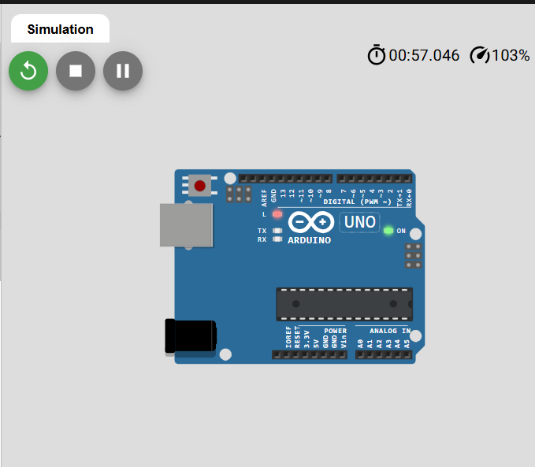
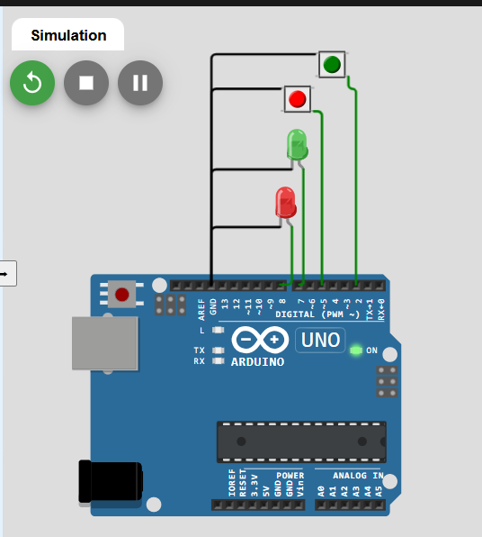
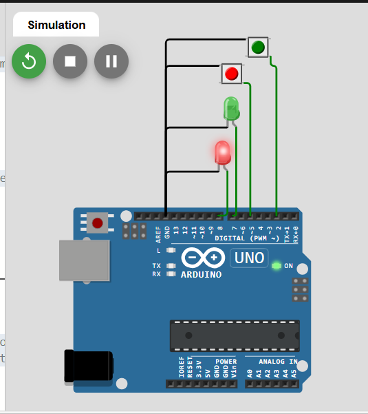
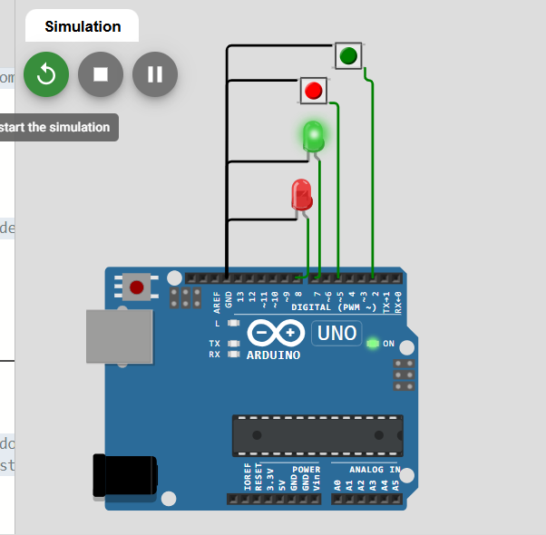
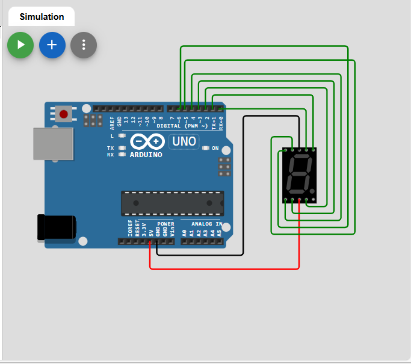
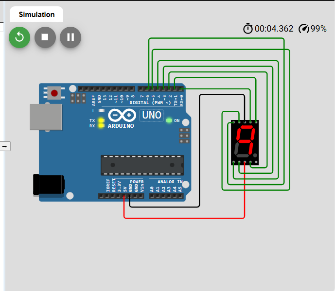
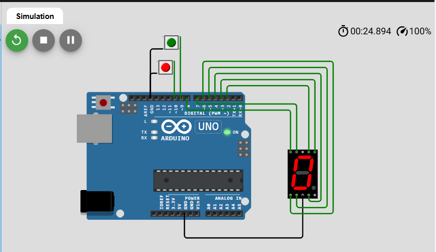
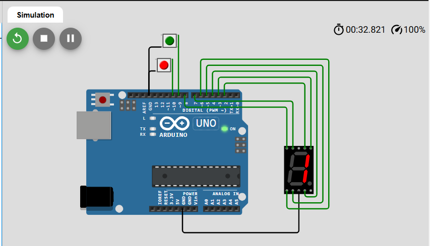
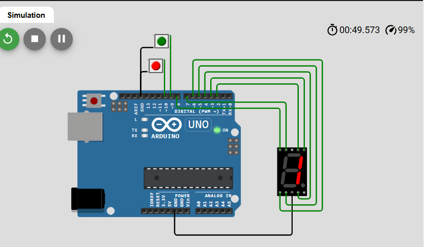

<p align="center">
 
</p>

## Relatório Prática 2 do Laboratório de Microprocessadores e Microcontroladores

**Aluna:** Amanda Soares Oliveira

**Matrícula:** 20183025624


### 1. Simule o circuito Olá Mundo com o Arduino no Wokwi.

**Procedimentos:**

* Criar projeto no wokwi com um arduino uno.

* Criar código que faça o ledpin do arduino piscar.

**Resultados:**


Projeto wokwi:

```
https://wokwi.com/projects/429125107544335361
``` 

Código Gerado: 

``` 
    int ledpin = 13;

    void setup() {
    pinMode(ledpin, OUTPUT);
    }

    void loop() {

    digitalWrite(ledpin, HIGH);
    delay(1000);
    digitalWrite(ledpin,LOW);
    delay(1000);
    }

``` 


Prints do projeto:


 Figura 1: Arduino com ledpin apagado.



Figura 2: Arduino com ledpin aceso.

**Conclusão:**

Este exercício foi fundamental para me familizar com o wokwi e com um microcontrolador que usaremos ao longo do curso, o arduino uno. Além de entender melhor sobre os códigos gerados e o que cada parte dele faz.

---

### 2. Projete um circuito com Arduino conectando a ele dois botões, um LED vermelho e um LED verde. Em seguida faça um programa em que quando um botão é pressionado o LED vermelho acende e o verde fica apagado. Quando o outro botão é pressionado os LEDs se alternam.


**Procedimentos:**

* Criar um projeto no wokwi com um arduino uno, dois botões ( verde e vermelho), e dois leds ( verde e vermelho).

* Ligar os Leds e botões no gnd e nos pinos do arduino.

* Criar código que faça apenas o led vermelho acender quando clicar no botão vermelho e que faça os leds ficarem alternando quando clicar no botão verde:


**Resultados:**

Projeto wokwi:

```
https://wokwi.com/projects/429127349672868865
``` 

Código gerado:

``` 

    //identificando os pinos que cada componente está ligado.
    int redLed = 8;
    int greenLed = 7;
    int button1 = 5;
    int button2 = 2;

    void setup() {
        // definindo o tipo de cada pino identificado acima.
        pinMode(redLed, OUTPUT);
        pinMode(greenLed, OUTPUT);
        pinMode(button1, INPUT_PULLUP);
        pinMode(button2, INPUT_PULLUP);
        digitalWrite(redLed, LOW);
        digitalWrite(greenLed, LOW);
    }

    void loop() {
        /* se o botão vermelho for acionado, o led vermelho 
        acenderá e o verde apagará caso esteja aceso. */
        if(digitalRead(button1) == LOW){
            digitalWrite(greenLed, LOW);
            digitalWrite(redLed, HIGH);   
        }
        /* se o botão verde for acionado, os leeds ficarão 
        piscando alternadamente com um intervalo de 500ms 
        até que o botão vermelho seja acionado novamente.*/
        if(digitalRead(button2) == LOW){
            while(digitalRead(buton1) == HIGH){
            digitalWrite(redLed, LOW);
            digitalWrite(greenLed, HIGH);
            delay(500);
            digitalWrite(redLed, HIGH);
            digitalWrite(greenLed, LOW);
            delay(500);
            }
        }
    }

```

Prints do projeto:



Figura 3: Projeto com leds apagados, sem nenhum clique de botão.



Figura 4: Projeto com led vermelho aceso após acionamento do botão vermelho.



Figura 5: Projeto com led verde aceso após acionamento do botão verde.

**Conclusão:**

Neste exercício criei um projeto mais elaborado com novos componentes e aprendi como ligá-los ao arduino. Além disso, aprendi mais sobre o pushbutton e a função debounce do simulador que permite que o arduino interprete o clique do botão como um único clique quando ele é pressionado.

---

### 3. Projete um circuito com o Arduino e um display de 7 segmentos, utilizando os pino digitais de 0 a 7 para os segmentos de “a” a “g”, respectivamente. Faça um programa que apresenta o número 9 neste display.

**Procedimentos:**

*  Criar um projeto no wokwi com um arduino uno e um display de 7 segmentos.

* Exibir o número 9 no display de 7 segmentos ao executar o projeto.

**Resultados:**

Projeto wokwi:

```
https://wokwi.com/projects/429602489348682753
``` 

Código gerado:

``` 
// definindo os pinos digitais
int segA = 0;
int segB = 1;
int segC = 2;
int segD = 3;
int segE = 4;
int segF = 5;
int segG = 6;

void setup() {
  // definindo os pinos como saída
  pinMode(segA, OUTPUT);
  pinMode(segB, OUTPUT);
  pinMode(segC, OUTPUT);
  pinMode(segD, OUTPUT);
  pinMode(segE, OUTPUT);
  pinMode(segF, OUTPUT);
  pinMode(segG, OUTPUT);
}

void loop() {
  /* desligando os segmentos D e E do display para 
  exibir o número 9 */
  digitalWrite(segD, HIGH);
  digitalWrite(segE, HIGH);
}

```

Prints do projeto:



Figura 6: Projeto antes da execução.



Figura 7: Projeto exibindo 9 no display.


**Conclusão:**

Neste exercício aprendi mais sobre o display de 7 segmentos e como ligá-lo ao arduino.

---

### 4. Adicione 2 botões ao circuito do exercício anterior e faça um programa onde uma contagem de 0 a 9 é apresentada no display. O número apresentado deve aumentar ou diminuir conforme os botões são pressionados, um botão aumenta e outro diminui o número apresentado no display.

**Procedimentos:**

*  Criar um projeto no wokwi com um arduino uno, dois botões e um display de 7 segmentos.

* Criar código para que o display exiba o número zero e caso o botão verde seja acionado, ele incrmente um e exiba o número correspondente e, caso o botão vermelho seja acionado, ele decremente um e exiba o número correspondente.

**Resultados:**

Projeto wokwi:

```
https://wokwi.com/projects/429614990216088577
``` 

Código gerado:

``` // definindo os pinos digitais
int segA = 2;
int segB = 3;
int segC = 4;
int segD = 5;
int segE = 6;
int segF = 7;
int segG = 8;
int count = 0;
int incButon = 9;
int decButon = 10;

void setup() {
  /* definindo os pinos do display como saída 
  e os pinos dos pushbutton como entrada */
  pinMode(segA, OUTPUT);
  pinMode(segB, OUTPUT);
  pinMode(segC, OUTPUT);
  pinMode(segD, OUTPUT);
  pinMode(segE, OUTPUT);
  pinMode(segF, OUTPUT);
  pinMode(segG, OUTPUT);
  pinMode(incButon, INPUT_PULLUP);
  pinMode(decButon, INPUT_PULLUP);
  // exibindo o estado inicial do contador no display
  displayNumber(count);
}

/* função que apaga e acende os segmentos de 
acordo com o valor do contador. 
Aqui o valor HIGH indica led desligado e 
LOW ligado porque os leds do display são 
catodo comum */

void displayNumber(int number){
  switch (number){
    case 0:
    // 0: apaga g 
      digitalWrite(segA, HIGH);
      digitalWrite(segB, HIGH);
      digitalWrite(segC, HIGH);
      digitalWrite(segD, HIGH);
      digitalWrite(segE, HIGH);
      digitalWrite(segF, HIGH);
      digitalWrite(segG, LOW);
      break;
    case 1:
      // 1: apaga adefg 
      digitalWrite(segA, LOW);
      digitalWrite(segB, HIGH);
      digitalWrite(segC, HIGH);
      digitalWrite(segD, LOW);
      digitalWrite(segE, LOW);
      digitalWrite(segF, LOW);
      digitalWrite(segG, LOW);
      break;
    case 2:    
      // 2: apaga fc
      digitalWrite(segA, HIGH);
      digitalWrite(segB, HIGH);
      digitalWrite(segC, LOW);
      digitalWrite(segD, HIGH);
      digitalWrite(segE, HIGH);
      digitalWrite(segF, LOW);
      digitalWrite(segG, HIGH);
      break;
    case 3:    
      // 3: apaga fe
      digitalWrite(segA, HIGH);
      digitalWrite(segB, HIGH);
      digitalWrite(segC, HIGH);
      digitalWrite(segD, HIGH);
      digitalWrite(segE, LOW);
      digitalWrite(segF, LOW);
      digitalWrite(segG, HIGH);
      break;
    case 4:
      // 4: apaga aed
      digitalWrite(segA, LOW);
      digitalWrite(segB, HIGH);
      digitalWrite(segC, HIGH);
      digitalWrite(segD, LOW);
      digitalWrite(segE, LOW);
      digitalWrite(segF, HIGH);
      digitalWrite(segG, HIGH);
      break;
    case 5:
    // 5: apaga be
      digitalWrite(segA, HIGH);
      digitalWrite(segB, LOW);
      digitalWrite(segC, HIGH);
      digitalWrite(segD, HIGH);
      digitalWrite(segE, LOW);
      digitalWrite(segF, HIGH);
      digitalWrite(segG, HIGH);
      break;
    case 6:
      // 6: apaga b
      digitalWrite(segA, HIGH);
      digitalWrite(segB, LOW);
      digitalWrite(segC, HIGH);
      digitalWrite(segD, HIGH);
      digitalWrite(segE, HIGH);
      digitalWrite(segF, HIGH);
      digitalWrite(segG, HIGH);
      break;
    case 7:
      // 7: apaga defg
      digitalWrite(segA, HIGH);
      digitalWrite(segB, HIGH);
      digitalWrite(segC, HIGH);
      digitalWrite(segD, LOW);
      digitalWrite(segE, LOW);
      digitalWrite(segF, LOW);
      digitalWrite(segG, LOW);
      break;
    case 8:
      // 8: acende tudo
      digitalWrite(segA, HIGH);
      digitalWrite(segB, HIGH);
      digitalWrite(segC, HIGH);
      digitalWrite(segD, HIGH);
      digitalWrite(segE, HIGH);
      digitalWrite(segF, HIGH);
      digitalWrite(segG, HIGH);
      break;
    case 9:
      // 9: apaga de
      digitalWrite(segA, HIGH);
      digitalWrite(segB, HIGH);
      digitalWrite(segC, HIGH);
      digitalWrite(segD, LOW);
      digitalWrite(segE, LOW);
      digitalWrite(segF, HIGH);
      digitalWrite(segG, HIGH);
      break;
  }
}

/* função principal, nas duas condições abaixo
o delay foi adicionado para que o código
funcionasse corretamente */
void loop() {
  /* verifica se o botão de incremento é 
  acionado para somar 1 no contador e
  chamar a fução que exibe o valor no display
  */
  if(digitalRead(incButon) == LOW){   
    count++;
    if (count > 9) count = 0;
    displayNumber(count);
    delay(500);
  }
    /* verifica se o botão de decremento é 
  acionado para subtrair 1 no contador e
  chamar a fução que exibe o valor no display
  */
  if(digitalRead(decButon) == LOW){    
    count--;
    if (count < 0 ) count = 9;
    displayNumber(count);
    delay(500); 
  } 
}

```

Prints do projeto:



Figura 8: Projeto com display exibindo estado inicial do contador = 0.



Figura 9: Projeto após um acionamento do botão verde, exibindo 1 no display.


Figura 10: Projeto após dois acionamentos do botão verde, exibindo 2 no display.



Figura 11: Projeto após um acionamento do botão vermelho, exibindo 1 no display.

**Conclusão:**

Neste exercício foi possível aprender como criar e utilizar funções no arduino. Uma dificuldade que tive ao logo do exercício foi que estava fazendo o código sem os delays após exibir o número no display, o que fazia o display exibir valores diferentes e lixo de memória. Após pesquisar e verificar exemplos da paltaforma wokwi, percebi que muitos códigos possuiam essa função, adicionei para testar e funcionou corretamente como eu esperava.

---
